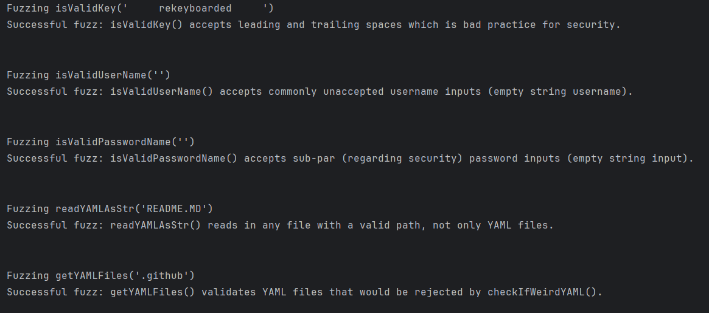

## NLB Project Logs/Screenshots
Static Analysis Output on Commit

Fuzz.py Output

Forensics added to 5 methods in parser.py:
  1. 
  2. 
  3. 
  4. 
  5. 

Forensical logging initialization in parser.py:
  1. 

